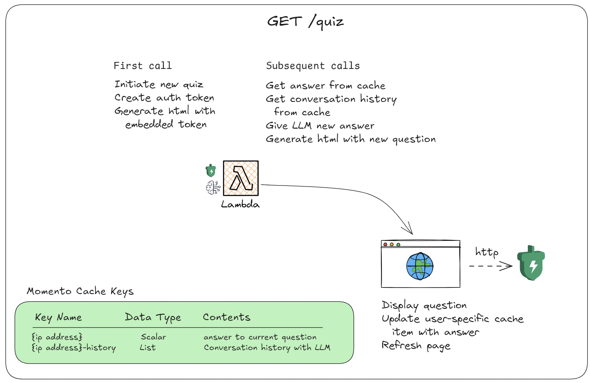

# Disney Quiz

This is a simple application that builds a Disney quiz using a single AWS Lambda function and Momento Cache. The application is deployed using AWS Serverless Application Model (AWS SAM) and utilizes the following AWS services:

* AWS Lambda: The core of the application, where the quiz logic is implemented.

* AWS API Gateway HTTP API: Provides a RESTful API endpoint for the quiz.

* Momento Cache: A distributed, in-memory cache used to store and retrieve quiz data.

* Amazon Bedrock: A fully managed service for building generative AI applications. The quiz function uses a foundation model (FM) from Anthropic to generate responses.

You can watch [how this app was made on YouTube](https://www.youtube.com/watch?v=e9LiHuqwu4Y).

## How it works

The application is defined in the `template.yaml` file, which is an AWS SAM template.

The `DisneyApi` resource creates an AWS API Gateway HTTP API with a single endpoint /quiz mapped to the GET method.

The `QuizFunction` resource defines the AWS Lambda function that handles the quiz logic.

The Lambda function uses the `@gomomento/sdk` library to interact with the Momento Cache.

The function also utilizes the Amazon Bedrock service to invoke a foundation model (FM) from Anthropic ( anthropic.claude-3-haiku-20240307-v1:0) for generating responses.

When a user accesses the /quiz endpoint, the Lambda function is triggered, and it generates a response based on the quiz logic and the Anthropic FM.

The response is then returned through the API Gateway HTTP API.



## Configuration

The application requires the following configuration:

* `MomentoApiKey`: The API key for accessing the Momento Cache service.

* `CACHE_NAME`: The name of the Momento Cache instance used for storing quiz data.

* `MODEL_ID`: The ID of the Anthropic foundation model used for generating responses.

## Deployment

To deploy the application, you'll need to have the AWS SAM CLI installed and configured with your AWS credentials. Then, you can run the following command from the project root:

```bash
sam build && sam deploy --guided
```

This will build the application and prompt you to provide the required configuration values (e.g., MomentoApiKey). After deployment, the API Gateway endpoint URL will be displayed in the output.

## Usage

Once deployed, you can access the quiz by sending a GET request to the /quiz endpoint of the API Gateway URL. The response will contain the generated quiz question and potential answers.

Note that this is a simplified example, and in a production environment, you may want to add additional features, error handling, and security measures.
